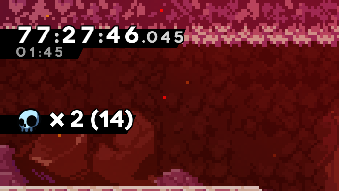

# DeathTracker (A Celeste Mod)

Keep track of your current and your personal best death counts while playing a chapter!
Comes with an optional feature to restart the chapter when you can no longer beat your PB.

## Display format settings

You can customize the text on the display via the in-game settings / the config file. 
(Note that Everest doesn't show text settings when you have a file selected)

Enter any format you like there. Certain values act as placeholders:

`$C` - Deaths of the current attempt 
`$B` - Best (lowest death count) clear 
`$A` - Total deaths of the current area 
`$T` - Total deaths of the save file 
`$L` - Deaths since the last level load 
`$S` - Deaths on the current screen (since the last screen transition) 

`$L` and `$S` show deaths for the current gaming session only, so they start at 0 when the game loads. 
In other words, they help you to keep track of your deaths on this level for the current gaming session (`$L`), or deaths on the current screen for the current gaming session (`$S`). 
If you switch level (for `$L`) or screen (for `$S`) and come back, they reset to 0.
